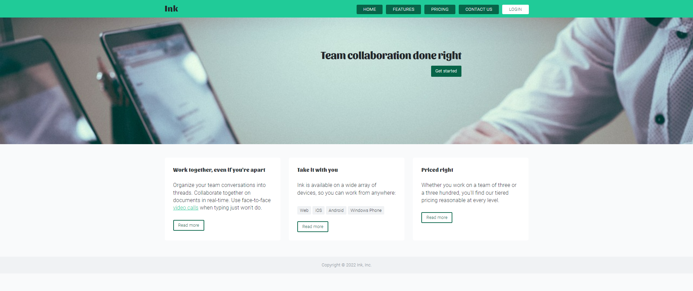
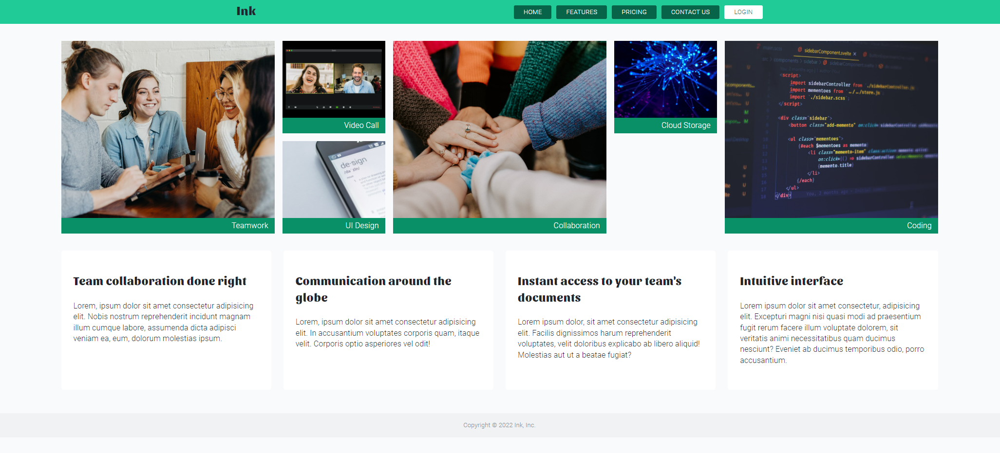
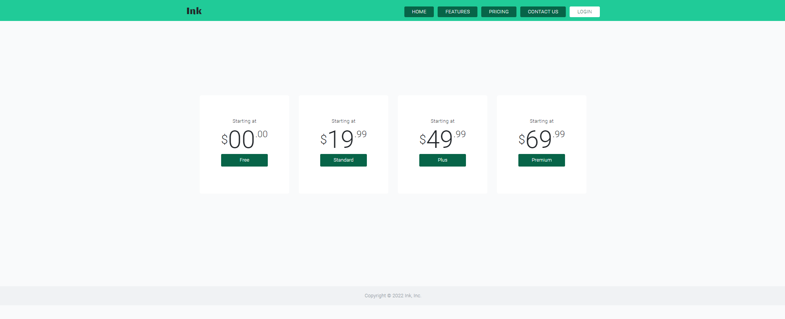
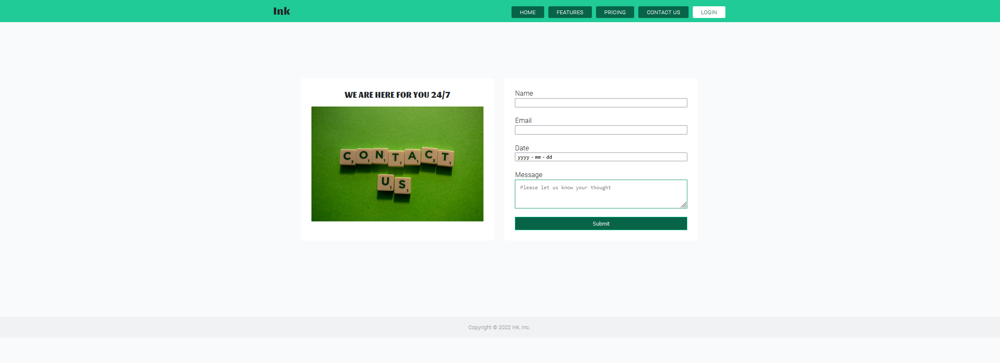
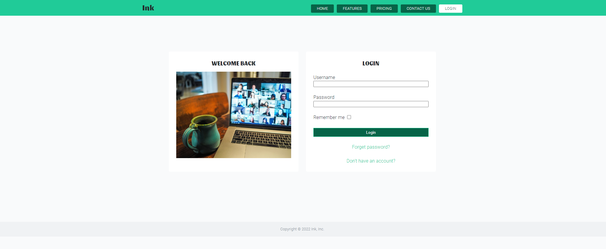
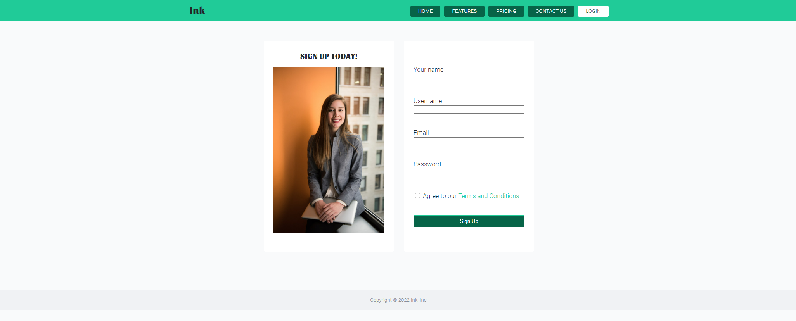

# Ink demo website

A demo site for a company called Ink,Inc. The website consists of a main landing page, a main content page showcasing product features and web contact form, signup/login forms.

## Table of contents

- [Ink demo website](#ink-demo-website)
  - [Table of contents](#table-of-contents)
  - [Overview](#overview)
    - [Requirements](#requirements)
    - [Screenshot](#screenshot)
    - [Links](#links)
  - [My process](#my-process)
    - [Built with](#built-with)
    - [What I learned](#what-i-learned)
    - [Continued development](#continued-development)
    - [Useful resources](#useful-resources)
  - [Author](#author)
  - [Acknowledgments](#acknowledgments)

## Overview

### Requirements

In this assignment, you will practice working with basic HTML tags, and attributes.

- Use HTML5 syntax to build at least 3 webpages to demonstrate your understanding of Semantic HTML syntax and structure.
- You have to have at least one page that features main content e.g., cooking recipes, movies summary and rating, car listings, etc.
- Your content has to be rich using text, images, etc.
- You have to have at least one page with brief content e.g., FAQ, About, Meet the Team, Customer testimonials, etc.
- You have to have at least one page with web form e.g., contact us, register, schedule time, etc.

### Screenshot

### Links

- Live Site: [Ink-demo](http://haolzz.github.io/ink-demo/)

## My process

### Built with

- CSS custom properties
- CSS Flexbox and Grid for layout

### What I learned

1. Web form elements and related accessibility attributes.

### Continued development

- Add media query for responsive layout
- Reorganize the single style.css into modular files
- Adopt a CSS framework(i.e Bootstrap) for styling

### Useful resources

## Author

- GitHub - [Haoliang Zhang](https://github.com/HaoLZz)
- LinkedIn - [Haoliang Zhang](https://www.linkedin.com/in/haoliangzhangengineer/)

## Acknowledgments

-Photos from [Unsplash](https://unsplash.com/)
